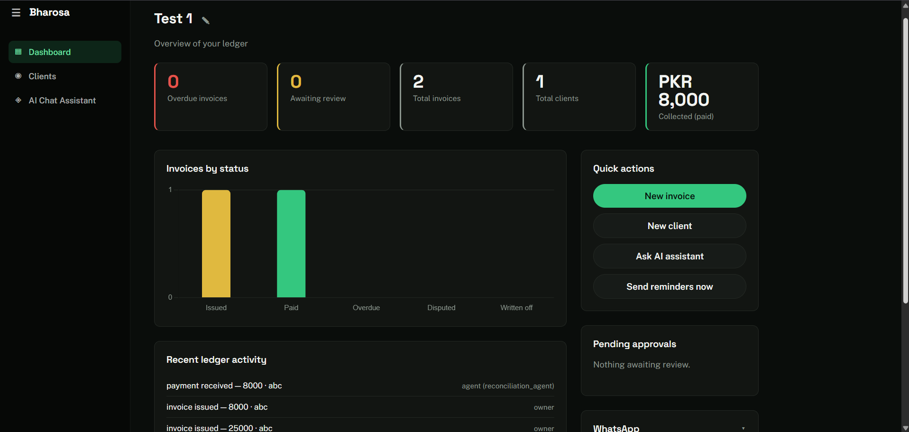
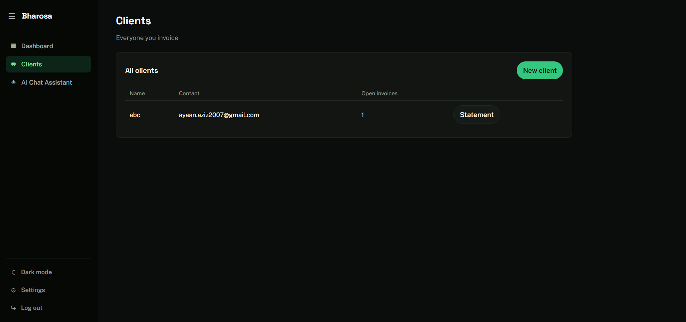
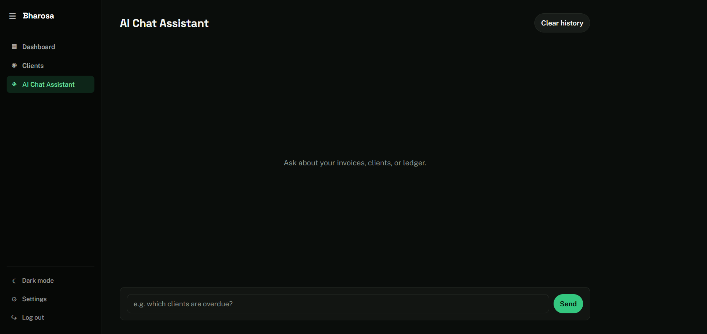

# Bharosa

A shared, verifiable ledger for B2B trade in Pakistan — invoices, payments, and disputes recorded once, seen by both sides. Automated by a set of narrow AI agents that act autonomously on low-risk decisions and defer to the owner on anything that touches real money.

**Live demo:** https://bharosa-blond.vercel.app
**Backend:** https://bharosa-udh0.onrender.com

## The problem

Pakistani B2B trade runs largely on informal credit — verbal agreements, no shared record of what was owed or when. That creates disputes neither side can resolve, because neither has a record the other trusts.

## What it does

- **Payment reconciliation** — upload a photo of a payment slip, OCR extracts the amount and transaction ID, and the system matches it against open invoices. Clean matches settle automatically; ambiguous ones queue for owner approval.
- **Automated reminders** — real email (via Resend) and WhatsApp (via Green API) reminders sent before and after due dates, on a schedule.
- **Dispute resolution** — an agent reads an invoice's ledger history against a client's dispute claim and judges plausibility. Small, high-confidence cases resolve automatically; larger or uncertain ones go to the owner.
- **Owner chatbot** — ask questions about your invoices, clients, or ledger in plain language.
- **Documents** — auto-generated invoice, receipt, and account statement PDFs pulled live from the ledger.

## Why trust actually holds up here

Every autonomous decision is schema-validated (never free text) and logged with its reasoning and a confidence score. `ledger_entries` and `agent_actions` are append-only — nothing is ever edited or deleted, only added. Below a confidence threshold, or above a size threshold, an agent doesn't act — it proposes, and the owner approves or rejects. The system can always show its work.

## Architecture

- **Frontend** — plain HTML/CSS/JS, no framework
- **Backend** — FastAPI
- **Database** — Supabase (Postgres + Row Level Security + Storage)
- **Agents** — LangChain/LangGraph tool-calling agents, backed by an OpenAI-compatible LLM (Groq)
- **OCR** — Tesseract
- **Scheduling** — APScheduler
- **Documents** — xhtml2pdf

Every table-level write goes through Row Level Security scoped to the business owner. Agent-internal writes use a service-role client that bypasses RLS by design, reserved for backend/agent code only — never exposed to a user-facing route.

## Agents

| Agent | Autonomy | What it does |
|---|---|---|
| Reconciliation | Tier 1 / Tier 3 | Matches payments to invoices; exact matches auto-settle, ambiguous cases go to owner review |
| Escalation | Tier 1 | Sends scheduled reminders — no owner approval needed, since it only sends messages, not money |
| Dispute Resolution | Tier 2 / Tier 3 | Judges dispute claims against ledger history; small/confident cases auto-resolve, larger ones escalate |
| Orchestrator | — | LangGraph state machine; the only component allowed to change an invoice's status |

## Running locally

```bash
# Backend
cd backend
python -m venv venv
venv\Scripts\activate        # Windows
pip install -r requirements.txt
uvicorn app.main:app --reload

# Frontend is served by the backend at http://localhost:8000
```

You'll need a `.env` at the repo root with Supabase, Groq, Resend, and Green API credentials — see `app/core/config.py` and `app/agents/config.py` for the full list of required variables.

## Deployment

Split hosting: frontend on Vercel (static), backend on Render (Docker, since it needs a persistent process for the scheduler and a system-level Tesseract install). See `Dockerfile` at the repo root.

## Screenshots





## Scope notes

Built as a milestone project under a hard deadline. Deliberately cut or simulated for Phase 1:

- **Payment gateways** (JazzCash, EasyPaisa) — UI is wired with a working `PaymentProvider` interface, but no real gateway is connected; buttons show a clear "not linked in this demo" state.
- **WhatsApp** — fully wired via Green API (QR-linking, real send capability), but not connected to a live number for this demo.
- **Bank statement parsing** — the ingestion layer supports it via a pluggable extractor interface, but only photographed slips (OCR) are implemented; bank statements are a stubbed Phase 2 extractor.
- **Client risk scoring** — the dashboard shows a lightweight, client-side heuristic computed from payment timing, not a standing scored profile maintained by an agent.

## License

MIT